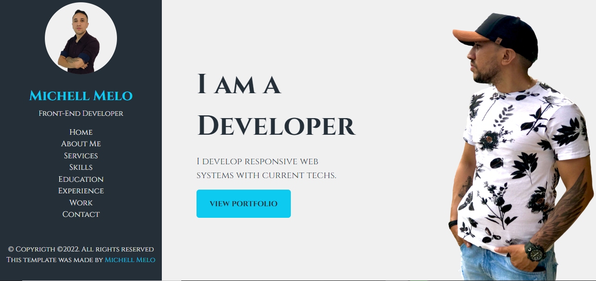

Modelo de página de perfil (Portifólio)

## Índice

- [Visão geral](#visãogeral)
  - [O desafio](#the-challenge)
  - [Captura de tela](#capturadetela)
- [Meu processo](#meu-processo)
  - [Construído com](#construídocom)
  - [O que aprendi](#o-que-aprendi)
- [Autor](#autor)

## Visão geral

### O desafio

Os usuários devem ser capazes de:

- Visualizar o layout ideal para o aplicativo, dependendo do tamanho da tela do dispositivo

### Captura de tela



## Meu processo

### Construído com

- Marcação HTML5
- Framework Bootstrap
- SASS
- CSS

### O que eu aprendi

- Responsividade
- Uso do SASS
- Bootstrap

```html
<nav>
  <ul class="navbar-nav">
    <li class="nav-item"><a class="link" href="index.html">Home</a></li>
  </ul>
</nav>
```

## Autor

- Linkendin - [Michell Melo](https://www.linkedin.com/in/michell-melo-23a6301a8)
